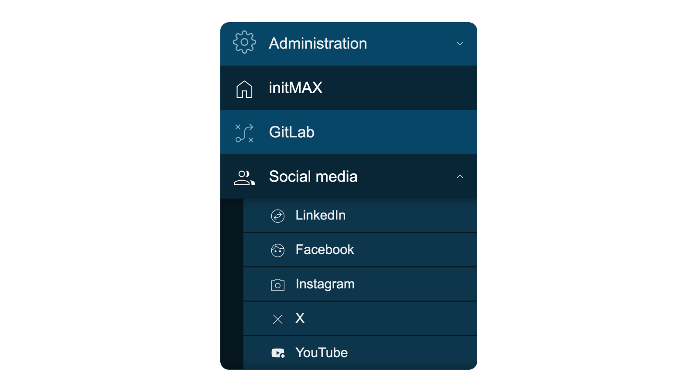

    <h1>
        🔒 PRO Version Available
    </h1>

This is a **PRO-only** product. The full version with all features is available through initMAX PRO subscription.

For more information about initMAX PRO, please visit: [https://www.initmax.com/eshop/](https://www.initmax.com/eshop/)

---

    
    <h3>
        
            Honesty, diligence and MAXimum knowledge of our products is our standard.
        
    </h3>
    <h3>
        &nbsp;&nbsp;&nbsp;
        &nbsp;&nbsp;&nbsp;
        &nbsp;&nbsp;&nbsp;
        &nbsp;&nbsp;&nbsp;
        &nbsp;&nbsp;&nbsp;
        
    </h3>

 

---
---

 
 

    <h1>
        Custom Menu Buttons
    </h1>
    <h4><i>
        Extend your Zabbix menu with custom buttons and sections
    </i></h4>
      
    
    
      
    

 
 

## Description
The Custom Menu Buttons module allows you to customize the Zabbix menu by giving users the option to insert new menu buttons and even full menu sections. These buttons can be labeled with text and icons, making them easily identifiable and visually appealing.

Users can place these buttons almost anywhere in the Zabbix menu. Each button can be configured with any URL, allowing direct access to needed resources.

This enhancement provides a flexible and easy-to-use way to extend the Zabbix interface, improving accessibility and workflow efficiency by enabling quick access to frequently used tools, reports, dashboards, or any other web resources.

## Key Features

### Menu Customization
- **Custom Menu Buttons**: Add new buttons to the main Zabbix menu or User section
- **Full Menu Sections**: Create complete menu sections with multiple buttons
- **Flexible Placement**: Position buttons almost anywhere in the Zabbix menu
- **Custom Labels**: Name your buttons with descriptive text
- **Icon Support**: Choose from available icons to make buttons easily identifiable

### URL Configuration
- **Any URL Support**: Link to any web resource
- **Direct Access**: Quick access to external tools, dashboards, or reports
- **Multiple Targets**: Configure different URLs for different buttons

### Placement Control
- **Placement Path**: Specify exact position in the Zabbix menu hierarchy
- **Insertion Types**: 
  - **Before**: Insert button before a specific section
  - **After**: Insert button after a specific section
  - **Append**: Add button to the end of a section
- **Menu Selection**: Choose between main menu or user section (bottom left)

### Use Cases
- **External Tools Integration**: Quick access to GitLab, monitoring dashboards, ticketing systems
- **Custom Dashboards**: Direct links to frequently used Zabbix dashboards
- **Documentation Links**: Easy access to internal wikis or documentation
- **Management Tools**: Links to other management interfaces
- **Social Media**: Quick access to team communication channels
- **Reporting Systems**: Direct access to business intelligence or reporting tools

  

    <a href="https://www.initmax.com/wiki/custom-menu-buttons-2/">
         
        <b>Documentation</b> 
        
    </a>

 
 

---
---

 

    <a href="https://www.initmax.com/">
         initMAX.com
    </a>&nbsp;&nbsp;&nbsp;
    <a href="tel:+420800244442">
         +420800244442
    </a>&nbsp;&nbsp;&nbsp;
    <a href="mailto:info@initmax.com">
         info@initmax.com
    </a>
       
    &nbsp;
    &nbsp;
    &nbsp;
    &nbsp;
    &nbsp;
       
    &nbsp;&nbsp;&nbsp;
    
       
    

