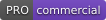
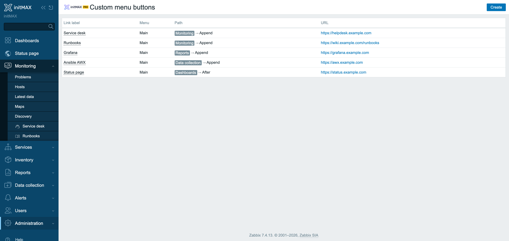
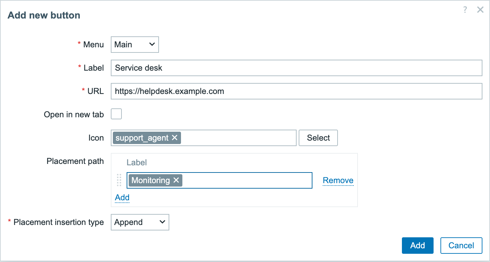
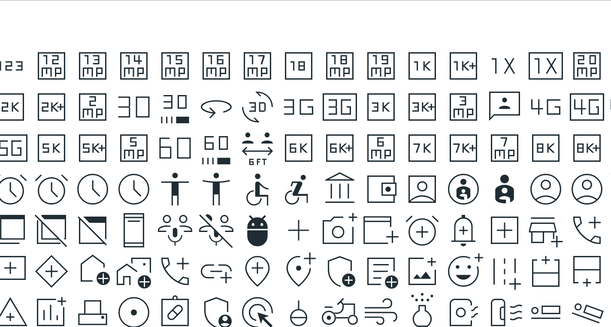

<h1>Custom menu buttons</h1>

developed and maintained by

<strong>Puts the tools your team already uses into the Zabbix menu.</strong> 
The ticketing system, the runbook wiki, the Grafana board - one click from wherever an operator already is, instead of a bookmark nobody on the night shift has.

<a href="#what-it-does"><strong>What it does</strong></a> &nbsp;·&nbsp;
<a href="#examples"><strong>Examples</strong></a> &nbsp;·&nbsp;
<a href="#what-you-get"><strong>What you get</strong></a> &nbsp;·&nbsp;
<a href="#install"><strong>Install</strong></a> &nbsp;·&nbsp;
<a href="#requirements"><strong>Requirements</strong></a> &nbsp;·&nbsp;
<a href="https://portal.initmax.com"><strong>Portal</strong></a> &nbsp;·&nbsp;
<a href="https://www.initmax.com/wiki/custom-menu-buttons-2/"><strong>Docs</strong></a>

 

---

## What it does

Zabbix's navigation is fixed. Everything else your operators touch during an incident - the service desk, the runbook, the change calendar, a Grafana board - lives somewhere else, and the way there is a bookmark, a pinned tab or a colleague on chat.

**Custom menu buttons** adds those destinations to the Zabbix menu itself. You choose the label, the URL, an icon, and exactly where the entry sits: appended to a section, or before or after any existing item, in the main sidebar or in the user menu. The entry then appears for everyone who uses that Zabbix, on every page.

There is nothing to deploy alongside it and nothing to maintain. Buttons are stored in the module's own configuration, so a frontend node added to the cluster tomorrow shows the same menu.

## Examples

<table>
<tr>
<td width="50%" align="center" valign="top"> <small><b>One button</b> - label, URL, icon, placement</small></td>
<td width="50%" align="center" valign="top"> <small><b>Icons</b> - the bundled set, searchable by name</small></td>
</tr>
</table>

A few placements that come up often:

| You want | Set it up as |
| --- | --- |
| A service desk next to **Monitoring → Problems** | placement path `Monitoring`, insertion **Append** |
| A Grafana board first in **Dashboards** | placement path `Dashboards`, insertion **Before** |
| A company intranet in the user menu | menu **User**, placement path `Sign out`, insertion **Before** |
| Anything that should not lose the Zabbix tab | tick **Open in new tab** |

## What you get

- **Buttons in both menus** - the main sidebar and the user menu.
- **Placement anywhere** - append to a section, or insert before or after any item that is already there, at any depth of submenu.
- **An icon per button** - from a bundled set of about 3600 glyphs, searchable by name, so a custom entry looks like a Zabbix one.
- **Same tab or new tab** - per button.
- **Managed from Zabbix** - under Administration, by a Super admin. No files to edit and nothing to redeploy.

## Install

The module ships as a **GPG-signed `deb` / `rpm` package** from the initMAX repository - `apt` / `dnf` installs it and keeps it updated. PRO packages need the repository credentials from your Portal account.

### Easiest way - the guided installer on the Portal

Open the product page, pick your **OS**, and copy the ready-made command.

<a href="https://portal.initmax.com/catalog/zabbix-xnavigation#how-to-install"><strong>→ Open the installer on the Portal</strong></a>

Prefer a plain archive? Every release also ships as a **ZIP** from the repository - handy for offline or manual installs.

Then enable it in **Administration → General → Modules**, and manage the buttons under **Administration → Custom menu buttons**.

## Requirements

|              |                                                              |
| ------------ | ------------------------------------------------------------ |
| **Zabbix**   | 6.0 · 6.2 · 6.4 · 7.0 · 7.2 · 7.4 - one package covers all    |
| **PHP**      | 7.4 or newer                                                 |
| **OS**       | Debian/Ubuntu · RHEL/Rocky/Alma/Oracle/Amazon · SUSE         |
| **Edition**  | PRO - commercial licence, see [LICENSE-PRO.md](./LICENSE-PRO.md) |
| **Permissions** | Super admin. The buttons are global configuration, so only a Super admin sees the management screen or the endpoints behind it |
| **Languages** | Every language Zabbix supports. The management screen is built from Zabbix's own labels, so it follows each user's display language; the text on your buttons is whatever you typed |
| **High availability** | Ready. Buttons live in the module's configuration in the Zabbix database, not on the frontend node - install it on every node of an HA cluster and any node serves the same menu |

### One package, six Zabbix versions

Zabbix changed its module API at 6.4 and renamed a good part of its form and page classes at 7.0, so the package carries two module trees and the installer deploys the one your frontend can load. The management screen and the button dialog are the same fields, the same labels and the same order on 6.0 as on 7.4.

Two cosmetic differences remain on the older line, and neither hides a capability:

- **Zabbix 6.0** does not render a documentation "?" link in the header of a module dialog - its overlay simply ignores the link the module sends. Every field and button is there.
- **Zabbix 6.0, 6.2 and 6.4** have no drag-and-drop framework for form rows, so the module reorders the placement path itself. The handle is in the same place and does the same thing; the animation while dragging is plainer.

## Support &amp; links

- 📚 **[Documentation / Wiki](https://www.initmax.com/wiki/custom-menu-buttons-2/)**
- 🛒 **[Product page](https://www.initmax.com/product/custom-menu-buttons/)**
- 🎫 **[Portal](https://portal.initmax.com)** - downloads, licences, support tickets
- ✉️ **[support@initmax.com](mailto:support@initmax.com)**

---

<a href="./LICENSE-PRO.md">initMAX Commercial License</a> &nbsp;·&nbsp; © 2021–2026 initMAX s.r.o.

