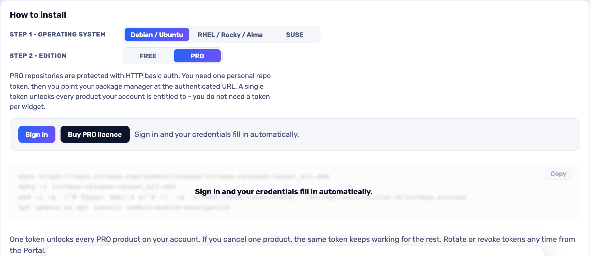

<h1>Custom menu buttons</h1>

developed and maintained by

and community

<strong>Puts the tools your team already uses into the Zabbix menu.</strong> 
The ticketing system, the runbook wiki, the Grafana board - one click from wherever an operator already is, instead of a bookmark nobody on the night shift has.

<a href="#what-you-can-build"><strong>Features</strong></a> &nbsp;·&nbsp;
<a href="#examples"><strong>Examples</strong></a> &nbsp;·&nbsp;
<a href="#install"><strong>Install</strong></a> &nbsp;·&nbsp;
<a href="#free-vs-pro"><strong>FREE vs PRO</strong></a> &nbsp;·&nbsp;
<a href="https://portal.initmax.com"><strong>Portal</strong></a> &nbsp;·&nbsp;
<a href="https://www.initmax.com/wiki/custom-menu-buttons/"><strong>Docs</strong></a>

 

---

## Why Custom menu buttons

Zabbix's navigation is fixed. Everything else your operators touch during an incident - the service desk, the runbook, the change calendar, a Grafana board - lives somewhere else, and the way there is a bookmark, a pinned tab or a colleague on chat.

**Custom menu buttons** adds those destinations to the Zabbix menu itself. You choose the label, the URL, an icon, and exactly where the entry sits: appended to a section, or before or after any existing item, in the main sidebar or in the user menu. The entry then appears for everyone who uses that Zabbix, on every page.

There is nothing to deploy alongside it and nothing to maintain. Buttons are stored in the module's own configuration, so a frontend node added to the cluster tomorrow shows the same menu.

## What you can build

<table>
<tr>
<td width="50%" valign="top">

**Your links in the main menu**

Runbooks, ticketing, Grafana, an intranet page - anything your team opens next to Zabbix.

</td>
<td width="50%" valign="top">

**About 3,600 icons to pick from**

A searchable icon library so each button reads at a glance in the sidebar.

</td>
</tr>
<tr>
<td width="50%" valign="top">

**Placed exactly where you want**

Before, after or inside an existing menu, in the main menu or in the user menu.

</td>
<td width="50%" valign="top">

**Same tab or a new one**

Decide per link whether it replaces the Zabbix page or opens beside it.

</td>
</tr>
</table>

## Examples

<table>
<tr>
<td width="50%" align="center" valign="top"> <small><b>Form</b> - Create a menu button with its label, URL, icon, target window and exact placement in the existing navigation tree.</small></td>
<td width="50%" align="center" valign="top"> <small><b>Icons</b> - Choose a clear visual marker from the built-in icon library so every custom destination is easy to recognize.</small></td>
</tr>
</table>

## Configuration

There is nothing to configure - install it, enable it, done. Buttons are managed under **Administration → Custom menu buttons**: label, URL, icon, the menu (main or user), the placement path and where the button goes relative to it. Every field carries a help hint, and a live "Where it lands" line under the placement path shows the resulting breadcrumb - *Main menu › Monitoring › Problems ▸ ✦ Runbook* - before you save.

## Install

**PRO** ships as **GPG-signed `deb` / `rpm` packages** from the initMAX repository - `apt` / `dnf` installs them and keeps them updated.

### Easiest way - the guided installer on the Portal

Open the product page, pick your **OS** and **edition**, and copy the ready-made command. FREE is fully public (no login); PRO fills in your token once you sign in. There's a feedback box right there too.

<a href="https://portal.initmax.com/catalog/zabbix-custom-menu-buttons#how-to-install"><strong>→ Open the installer on the Portal</strong></a>

Prefer a plain archive? Every release also ships as a **ZIP**, downloadable from the portal once you sign in - handy for offline or manual installs.

The module is enabled automatically during the package installation - verify it in **Administration → General → Modules**. Done.

## FREE vs PRO

This product is sold as PRO - there is no FREE edition. Everything below is in the one package.

| Feature | PRO |
| ---------------------------------------------------------- | :----: |
| Links in the main and user menus | ✅ |
| About 3,600 searchable icons | ✅ |
| Place before, after or inside a menu | ✅ |
| Same or new tab per link | ✅ |
| Localised into all 25 Zabbix display languages | ✅ |
| High availability ready | ✅ |
| Licence | [Commercial](./LICENSE-PRO.md) |

## Requirements

|              |                                                              |
| ------------ | ------------------------------------------------------------ |
| **Zabbix**   | 6.0 · 6.2 · 6.4 · 7.0 · 7.2 · 7.4 - one package covers all    |
| **PHP**      | 7.4 or newer                                                 |
| **OS**       | Debian/Ubuntu · RHEL/Rocky/Alma/Oracle/Amazon · SUSE         |
| **Editions** | PRO (token-gated repo) - there is no free edition                  |
| **Permissions** | Super admin. The buttons are global configuration, so only a Super admin sees the management screen or the endpoints behind it |
| **Languages** | All 25 Zabbix display languages - the module follows each user's own language setting |
| **High availability** | Ready. Buttons live in the module's configuration in the Zabbix database, not on the frontend node - install it on every node of an HA cluster and any node serves the same menu |

### One package, six Zabbix versions

Zabbix changed its module API at 6.4 and renamed a good part of its form and page classes at 7.0, so the package carries two module trees and the installer deploys the one your frontend can load. The management screen and the button dialog are the same fields, the same labels and the same order on 6.0 as on 7.4.

Two cosmetic differences remain on the older line, and neither hides a capability:

- **Zabbix 6.0** does not render a documentation "?" link in the header of a module dialog - its overlay simply ignores the link the module sends. Every field and button is there.
- **Zabbix 6.0, 6.2 and 6.4** have no drag-and-drop framework for form rows, so the module reorders the placement path itself. The handle is in the same place and does the same thing; the animation while dragging is plainer.

## Support &amp; links

- **[Documentation / Wiki](https://www.initmax.com/wiki/custom-menu-buttons/)**
- **[Product page](https://www.initmax.com/product/custom-menu-buttons/)**
- **[Portal](https://portal.initmax.com)** - downloads, tokens, support tickets
- **[support@initmax.com](mailto:support@initmax.com)**

---

PRO: <a href="./LICENSE-PRO.md">commercial</a> &nbsp;·&nbsp; © 2021–2026 initMAX s.r.o.

